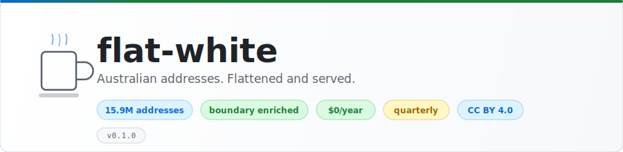
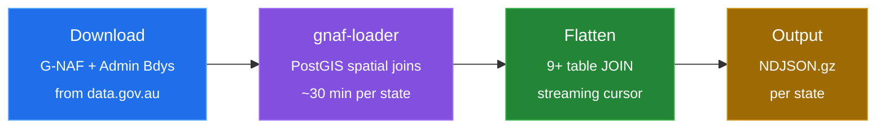
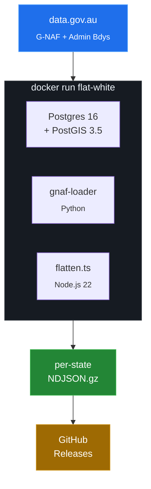
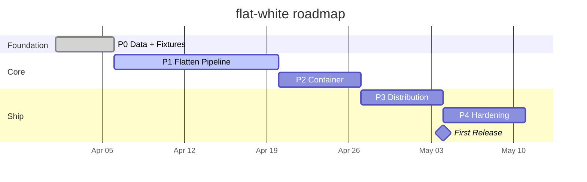

<picture>
  <source media="(prefers-color-scheme: dark)" srcset="docs/assets/banner-dark.svg">
  <source media="(prefers-color-scheme: light)" srcset="docs/assets/banner-light.svg">
  
</picture>

<p align="center">
  <a href="https://github.com/jbejenar/flat-white/actions/workflows/ci.yml"></a>
  <a href="./LICENSE"></a>
  
  
  
</p>

<p align="center">
  <a href="#quick-start">Quick Start</a>&ensp;&bull;&ensp;
  <a href="#whats-in-a-document">Schema</a>&ensp;&bull;&ensp;
  <a href="#use-cases">Use Cases</a>&ensp;&bull;&ensp;
  <a href="#how-it-works">How It Works</a>&ensp;&bull;&ensp;
  <a href="#build-it-yourself">Build</a>&ensp;&bull;&ensp;
  <a href="ROADMAP.md">Roadmap</a>
</p>

---

## What is this?

flat-white takes Australia's two canonical government datasets — [G-NAF](https://data.gov.au/data/dataset/geocoded-national-address-file-g-naf) (every physical address) and [Administrative Boundaries](https://data.gov.au/data/dataset/geoscape-administrative-boundaries) (LGA, electoral, ABS) — and joins them into a **single flat file** of one-document-per-address NDJSON.

Every document contains the full address, multiple geocode types, locality context with neighbours and aliases, and all boundary enrichment (LGA, ward, state electorate, commonwealth electorate, mesh block, SA1-SA4, GCCSA). No joins. No database. Just download and search.

---

## Quick Start

Download your state and start querying in under 60 seconds:

```bash
# Download Victoria
gh release download latest --pattern '*-vic.ndjson.gz'

# Count addresses
zcat flat-white-*-vic.ndjson.gz | wc -l
# → 3,821,044

# Find addresses in a postcode
zcat flat-white-*-vic.ndjson.gz | jq -c 'select(.postcode == "3000")' | head -3

# Query with DuckDB
duckdb -c "SELECT addressLabel, boundaries.lga.name, boundaries.sa2.name
           FROM read_ndjson_auto('flat-white-*-vic.ndjson.gz')
           WHERE postcode = '3000' LIMIT 5"
```

Or browse the [Releases](../../releases) page.

---

## What's in a document?

Every line in the NDJSON is one address. Here's a real example:

```json
{
  "_id": "GAVIC425181432",
  "addressLabel": "1 MCNAB AV, FOOTSCRAY VIC 3011",
  "state": "VIC",
  "postcode": "3011",
  "geocode": {
    "latitude": -37.798,
    "longitude": 144.897,
    "type": "FRONTAGE CENTRE SETBACK",
    "reliability": 2
  },
  "boundaries": {
    "lga": { "name": "MARIBYRNONG", "code": "LGA24650" },
    "stateElectorate": { "name": "FOOTSCRAY" },
    "commonwealthElectorate": { "name": "GELLIBRAND" },
    "meshBlock": { "code": "20663890000", "category": "COMMERCIAL" },
    "sa2": { "code": "20604", "name": "FOOTSCRAY" },
    "sa4": { "code": "2", "name": "MELBOURNE - WEST" },
    "gccsa": { "code": "2GMEL", "name": "GREATER MELBOURNE" }
  },
  "locality": {
    "neighbours": ["ASCOT VALE", "FLEMINGTON", "KENSINGTON", "SEDDON"],
    "aliases": ["FOOTSCRAY WEST"]
  }
}
```

Full schema: [DOCUMENT-SCHEMA.md](docs/DOCUMENT-SCHEMA.md)

---

## By the Numbers

<table>
<tr>
<td align="center"><h3>15.9M</h3><sub>Addresses</sub></td>
<td align="center"><h3>9</h3><sub>States</sub></td>
<td align="center"><h3>10</h3><sub>Boundary types</sub></td>
<td align="center"><h3>$0</h3><sub>Annual cost</sub></td>
<td align="center"><h3>~50min</h3><sub>Build time</sub></td>
<td align="center"><h3>Quarterly</h3><sub>Updates</sub></td>
</tr>
</table>

---

## Use Cases

| Use Case | How |
|---|---|
| **Self-host address validation** | Pipe into OpenSearch/Elasticsearch, add a Lambda, done |
| **Drop-in address data** | Pre-joined, boundary-enriched — no commercial licence required |
| **Data science** | 15.9M geocoded, boundary-enriched records ready for analysis |
| **Government** | Every department gets the same data without separate vendor contracts |

---

## How It Works



> **Postgres is a build tool.** It lives inside the container for ~30 minutes per state, then it dies. The NDJSON is the only artifact.



---

## Build It Yourself

```bash
# Full build — all states
docker run -v $(pwd)/output:/output flat-white \
  --states ALL --split-states --compress --output /output/

# Single state
docker run -v $(pwd)/output:/output flat-white \
  --states VIC --compress --output /output/

# Dev mode — fixture data only (~30 seconds)
docker run -v $(pwd)/output:/output flat-white \
  --fixture-only --output /output/fixture.ndjson
```

### State Sizes

| State | Est. Addresses |
|:---:|---:|
| NSW | ~4.5M |
| VIC | ~3.9M |
| QLD | ~2.9M |
| WA | ~1.3M |
| SA | ~1.1M |
| TAS | ~310K |
| ACT | ~220K |
| NT | ~98K |
| OT | ~3K |
| **Total** | **~15.9M** |

> Estimates based on G-NAF Feb 2026 principal addresses. The 15.9M total includes aliases and secondaries. Exact counts will be published with the first release.

---

## Distribution

Every quarter, a [GitHub Actions](https://github.com/features/actions) matrix build runs **9 parallel jobs** on free runners — one per state. Per-state gzipped NDJSON files are published as [GitHub Release](../../releases) assets.

**Total cost: $0.** Free runners. Free hosting. Free forever.

```bash
# Download programmatically
gh release download v2026.02 --pattern '*-vic.ndjson.gz'

# Or via curl
curl -LO "https://github.com/jbejenar/flat-white/releases/download/v2026.02/flat-white-2026.02-vic.ndjson.gz"
```

---

## Data Sources

| Dataset | Source | Licence | Updated |
|---|---|---|---|
| G-NAF | [data.gov.au](https://data.gov.au/data/dataset/geocoded-national-address-file-g-naf) | CC BY 4.0 | Quarterly |
| Admin Boundaries | [data.gov.au](https://data.gov.au/data/dataset/geoscape-administrative-boundaries) | CC BY 4.0 | Quarterly |

---

## Tech Stack

| Layer | Technology |
|---|---|
| Database | PostgreSQL 16 + PostGIS 3.5 (ephemeral) |
| Data loader | [minus34/gnaf-loader](https://github.com/minus34/gnaf-loader) (Python) |
| Flattener | Node.js 22 / TypeScript (streaming) |
| Container | Docker (Debian Bookworm) |
| CI/CD | GitHub Actions (free tier, matrix build) |
| Output | NDJSON (per-state, gzipped) |
| Distribution | GitHub Releases |

---

## Project Status



<table>
<tr>
<td align="center"><h3>72/100</h3><sub>ARI Score (L4)</sub></td>
<td align="center"><h3>5 / 66</h3><sub>Tickets Done</sub></td>
<td align="center"><h3>451</h3><sub>Fixture Addresses</sub></td>
<td align="center"><h3>P0</h3><sub>Current Phase</sub></td>
</tr>
</table>

See [ROADMAP.md](ROADMAP.md) for the full 66-ticket plan across 8 phases.

---

## Attribution

> G-NAF &copy; Geoscape Australia licensed by the Commonwealth of Australia under the Open G-NAF End User Licence Agreement.

> Administrative Boundaries &copy; Geoscape Australia licensed by the Commonwealth of Australia under CC BY 4.0.

---

## Licence

[Apache 2.0](LICENSE)
