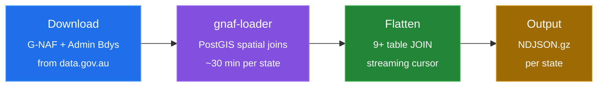
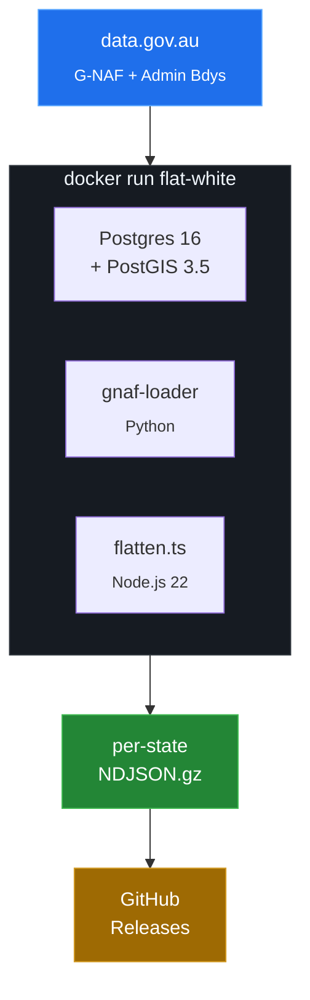
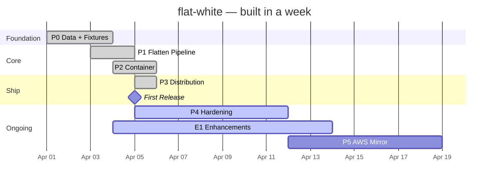

<picture>
  <source media="(prefers-color-scheme: dark)" srcset="docs/assets/banner-dark.svg">
  <source media="(prefers-color-scheme: light)" srcset="docs/assets/banner-light.svg">
  
</picture>

<p align="center">
  <a href="https://github.com/jbejenar/flat-white/actions/workflows/ci.yml"></a>
  <a href="./LICENSE"></a>
  
  
  <a href=".github/workflows/ariscan.yml"></a>
</p>

<p align="center">
  <a href="#quick-start">Quick Start</a>&ensp;&bull;&ensp;
  <a href="#whats-in-a-document">Schema</a>&ensp;&bull;&ensp;
  <a href="#use-cases">Use Cases</a>&ensp;&bull;&ensp;
  <a href="#how-it-works">How It Works</a>&ensp;&bull;&ensp;
  <a href="#build-it-yourself">Build</a>&ensp;&bull;&ensp;
  <a href="ROADMAP.md">Roadmap</a>
</p>

---

## What is this?

flat-white takes Australia's two canonical government datasets — [G-NAF](https://data.gov.au/data/dataset/geocoded-national-address-file-g-naf) (every physical address) and [Administrative Boundaries](https://data.gov.au/data/dataset/geoscape-administrative-boundaries) (LGA, electoral, ABS) — and joins them into a **single flat file** of one-document-per-address NDJSON.

Every document contains the full address, multiple geocode types, locality context with neighbours and aliases, and all boundary enrichment (LGA, ward, state electorate, commonwealth electorate, mesh block, SA1-SA4, GCCSA). No joins. No database. Just download and search.

---

## Quick Start

Download your state and start querying in under 60 seconds:

```bash
# Download Victoria
gh release download latest --pattern '*-vic.ndjson.gz'

# Count addresses
zcat flat-white-*-vic.ndjson.gz | wc -l
# → 3,821,044

# Find addresses in a postcode
zcat flat-white-*-vic.ndjson.gz | jq -c 'select(.postcode == "3000")' | head -3

# Query with DuckDB
duckdb -c "SELECT addressLabel, boundaries.lga.name, boundaries.sa2.name
           FROM read_ndjson_auto('flat-white-*-vic.ndjson.gz')
           WHERE postcode = '3000' LIMIT 5"
```

Or browse the [Releases](../../releases) page.

---

## What's in a document?

Every line in the NDJSON is one address. Here's a real example:

```json
{
  "_id": "GAVIC425181432",
  "addressLabel": "1 MCNAB AV, FOOTSCRAY VIC 3011",
  "state": "VIC",
  "postcode": "3011",
  "geocode": {
    "latitude": -37.798,
    "longitude": 144.897,
    "type": "FRONTAGE CENTRE SETBACK",
    "reliability": 2
  },
  "boundaries": {
    "lga": { "name": "MARIBYRNONG", "code": "LGA24650" },
    "stateElectorate": { "name": "FOOTSCRAY" },
    "commonwealthElectorate": { "name": "GELLIBRAND" },
    "meshBlock": { "code": "20663890000", "category": "COMMERCIAL" },
    "sa2": { "code": "20604", "name": "FOOTSCRAY" },
    "sa4": { "code": "2", "name": "MELBOURNE - WEST" },
    "gccsa": { "code": "2GMEL", "name": "GREATER MELBOURNE" }
  },
  "locality": {
    "neighbours": ["ASCOT VALE", "FLEMINGTON", "KENSINGTON", "SEDDON"],
    "aliases": ["FOOTSCRAY WEST"]
  }
}
```

Full schema: [DOCUMENT-SCHEMA.md](docs/DOCUMENT-SCHEMA.md)

---

## By the Numbers

<table>
<tr>
<td align="center"><h3>15.9M</h3><sub>Addresses</sub></td>
<td align="center"><h3>9</h3><sub>States</sub></td>
<td align="center"><h3>10</h3><sub>Boundary types</sub></td>
<td align="center"><h3>$0</h3><sub>Annual cost</sub></td>
<td align="center"><h3>~50min</h3><sub>Build time</sub></td>
<td align="center"><h3>Quarterly</h3><sub>Updates</sub></td>
</tr>
</table>

---

## Use Cases

| Use Case                         | How                                                                   |
| -------------------------------- | --------------------------------------------------------------------- |
| **Self-host address validation** | Pipe into OpenSearch/Elasticsearch, add a Lambda, done                |
| **Drop-in address data**         | Pre-joined, boundary-enriched — no commercial licence required        |
| **Data science**                 | 15.9M geocoded, boundary-enriched records ready for analysis          |
| **Government**                   | Every department gets the same data without separate vendor contracts |

---

## How It Works



> **Postgres is a build tool.** It lives inside the container for ~30 minutes per state, then it dies. The NDJSON is the only artifact.



---

## Build It Yourself

```bash
# Full build — all states
docker run -v $(pwd)/output:/output flat-white \
  --states ALL --split-states --compress --output /output/

# Single state
docker run -v $(pwd)/output:/output flat-white \
  --states VIC --compress --output /output/

# Dev mode — fixture data only (~30 seconds)
docker run -v $(pwd)/output:/output flat-white \
  --fixture-only --output /output/fixture.ndjson
```

### State Sizes

|   State   | Est. Addresses |
| :-------: | -------------: |
|    NSW    |          ~4.5M |
|    VIC    |          ~3.9M |
|    QLD    |          ~2.9M |
|    WA     |          ~1.3M |
|    SA     |          ~1.1M |
|    TAS    |          ~310K |
|    ACT    |          ~220K |
|    NT     |           ~98K |
|    OT     |            ~3K |
| **Total** |     **~15.9M** |

> Estimates based on G-NAF Feb 2026 principal addresses. The 15.9M total includes aliases and secondaries. Exact counts will be published with the first release.

---

## Distribution

Every quarter, a [GitHub Actions](https://github.com/features/actions) matrix build runs **9 parallel jobs** on free runners — one per state. Per-state gzipped NDJSON files are published as [GitHub Release](../../releases) assets.

**Total cost: $0.** Free runners. Free hosting. Free forever.

```bash
# Download a single state
gh release download latest --repo jbejenar/flat-white --pattern '*-vic.ndjson.gz'

# Download all states (9 per-state files)
gh release download latest --repo jbejenar/flat-white --pattern '*.ndjson.gz'

# Combine into one file (concatenated gzips are valid gzip)
cat flat-white-*-*.ndjson.gz > flat-white-all.ndjson.gz

# Or via curl (replace VERSION with e.g. 2026.04)
curl -LO "https://github.com/jbejenar/flat-white/releases/download/vVERSION/flat-white-VERSION-vic.ndjson.gz"
```

### Programmatic Download (CI / Scripts)

Use the GitHub API to fetch the latest release and download assets:

```bash
# Get the latest release tag
TAG=$(gh api repos/jbejenar/flat-white/releases/latest --jq '.tag_name')

# Download a specific state
gh release download "$TAG" --repo jbejenar/flat-white --pattern '*-vic.ndjson.gz'

# Download metadata to check counts before downloading data
gh release download "$TAG" --repo jbejenar/flat-white --pattern 'metadata.json'
cat metadata.json | jq .
```

### Verify Your Download

After downloading, verify integrity and validate against the schema:

```bash
# Decompress, check line count against metadata, validate 3 random documents
STATE="vic"; VERSION="2026.02"
FILE="flat-white-${VERSION}-${STATE}.ndjson.gz"
gzip -t "$FILE" && echo "gzip OK"
LINES=$(zcat "$FILE" | wc -l | tr -d ' ') && echo "$LINES documents"
zcat "$FILE" | shuf -n 3 | jq . > /dev/null && echo "schema OK"
```

---

## Data Sources

| Dataset          | Source                                                                               | Licence   | Updated   |
| ---------------- | ------------------------------------------------------------------------------------ | --------- | --------- |
| G-NAF            | [data.gov.au](https://data.gov.au/data/dataset/geocoded-national-address-file-g-naf) | CC BY 4.0 | Quarterly |
| Admin Boundaries | [data.gov.au](https://data.gov.au/data/dataset/geoscape-administrative-boundaries)   | CC BY 4.0 | Quarterly |

---

## Standing on Shoulders

flat-white wouldn't exist without [Hugh Saalmans](https://github.com/minus34) and his [gnaf-loader](https://github.com/minus34/gnaf-loader) project. Hugh has spent **a decade** maintaining the Python pipeline that turns raw G-NAF PSV files into a queryable PostGIS database with spatial boundary joins. flat-white literally vendors gnaf-loader as a git submodule and runs it as the first step of every build. **Thank you, Hugh.** 🙏

### Already published as parquet — by Hugh

Hugh also publishes the same data as **GeoParquet files on S3** (anonymous read, free):

```bash
# 37 separate parquet tables (raw relational structure)
aws s3 ls s3://minus34.com/opendata/geoscape-202602/geoparquet/ --no-sign-request
```

### Why flat-white runs its own pipeline

flat-white goes **straight to the government source** at [data.gov.au](https://data.gov.au) — the same starting point as gnaf-loader, not downstream of it. This is deliberate:

- **Independence.** Builds aren't blocked by anyone's release schedule. When data.gov.au publishes a quarterly update, flat-white can ship a release that day.
- **Verifiability.** Every byte in the output traces back to the canonical Australian government source, processed by code in this repo. Auditors can re-derive it from scratch.
- **Postgres is the right tool for the join.** A 9-table relational join with millions of rows belongs in PostgreSQL. It's rock-solid, well-understood, easy to debug, and produces the same answer every time. Doing the same join in DuckDB-over-parquet would mean rewriting the SQL in a different dialect and losing 30 years of Postgres optimizer work.
- **Quarterly cadence is fine.** G-NAF publishes quarterly. There's no daily feed, no real-time stream — quarterly is the rhythm of the data itself. Spending ~30 min per state on a free runner four times a year is not a cost worth optimizing.

We could read minus34's parquet directly, but then flat-white would be a thin wrapper around someone else's pipeline. By running gnaf-loader ourselves we keep full control of the build, validate every document with Zod, and own the entire chain from raw PSV files to NDJSON.

### When to use which

| Need                                                                | Use                             |
| ------------------------------------------------------------------- | ------------------------------- |
| Run analytical SQL with DuckDB or Spark/Sedona                      | **minus34/gnaf-loader parquet** |
| Spatial joins with proper geometry (WKB)                            | **minus34/gnaf-loader parquet** |
| Smallest possible download (columnar Snappy)                        | **minus34/gnaf-loader parquet** |
| Index addresses into Elasticsearch / OpenSearch / Algolia / MongoDB | **flat-white NDJSON**           |
| `grep` / `jq` / `awk` an address by PID or postcode                 | **flat-white NDJSON**           |
| Avoid writing 9-table JOINs                                         | **flat-white NDJSON**           |
| Pre-validated documents with a guaranteed schema                    | **flat-white NDJSON**           |

flat-white and gnaf-loader's parquet are **the same data, different formats** — pick the one that fits your tools. If you're doing analytics, go straight to S3. If you're building search or doc-oriented apps, NDJSON is easier.

---

## Tech Stack

| Layer        | Technology                                                             |
| ------------ | ---------------------------------------------------------------------- |
| Database     | PostgreSQL 16 + PostGIS 3.5 (ephemeral)                                |
| Data loader  | [minus34/gnaf-loader](https://github.com/minus34/gnaf-loader) (Python) |
| Flattener    | Node.js 22 / TypeScript (streaming)                                    |
| Container    | Docker (Debian Bookworm)                                               |
| CI/CD        | GitHub Actions (free tier, matrix build)                               |
| Output       | NDJSON (per-state, gzipped)                                            |
| Distribution | GitHub Releases                                                        |

---

## AI-Ready Development

<a href=".github/workflows/ariscan.yml"></a> &ensp; Measured by [ariscan](https://github.com/prontiq/ariscan-cli) — the Agent Readiness Index.

This repo is built for **autonomous AI coding agents**. Every push to `main` runs [ariscan](https://github.com/prontiq/ariscan-cli) to measure and track agent readiness across 8 pillars. The badge above updates automatically; pillar breakdown as of last audit:

| Pillar                  | Score | What it measures                              |
| ----------------------- | ----- | --------------------------------------------- |
| Agent Context Quality   | 100   | CLAUDE.md, AGENTS.md, .agentignore            |
| Feedback Loop Speed     | 100   | Tests, lint, CI turnaround                    |
| Security & Governance   | 100   | Dependabot, SAST, branch protection           |
| Dev Environment         | 97    | Devcontainer, setup scripts, versions         |
| Build Determinism       | 70    | TypeScript strict, lockfile, pre-commit hooks |
| Code Navigability       | 69    | File structure, naming, imports               |
| Doc Machine-Readability | 50    | API specs, structured docs                    |
| Test Isolation          | 35    | Test-to-source ratio, anti-patterns           |

**Key guardrails:**

- [`CLAUDE.md`](CLAUDE.md) — auto-loaded rules for Claude Code sessions (sandbox boundaries, read discipline, streaming rules)
- [`NEXT-WORK.md`](NEXT-WORK.md) — active tickets for agents (avoids scanning the 4,490-line roadmap)
- [`fixtures/SCHEMA-REFERENCE.md`](fixtures/SCHEMA-REFERENCE.md) — table schemas (~220 lines vs 10k-line SQL fixture)
- Pre-commit hooks reject empty files and `sql.unsafe()` without `.cursor()`
- [CodeQL SAST](.github/workflows/sast.yml) on every push and PR

---

## Project Status



<table>
<tr>
<td align="center"><h3>74/100</h3><sub>ARI Score (L4)</sub></td>
<td align="center"><h3>56 / 66</h3><sub>Tickets Done</sub></td>
<td align="center"><h3>15M</h3><sub>Addresses Released</sub></td>
<td align="center"><h3>v2026.04</h3><sub>Latest Release</sub></td>
</tr>
</table>

See [ROADMAP.md](ROADMAP.md) for the full 66-ticket plan across 8 phases. [First release shipped!](../../releases/tag/v2026.04)

---

## Attribution

> G-NAF &copy; Geoscape Australia licensed by the Commonwealth of Australia under the Open G-NAF End User Licence Agreement.

> Administrative Boundaries &copy; Geoscape Australia licensed by the Commonwealth of Australia under CC BY 4.0.

---

## Licence

[Apache 2.0](LICENSE)
