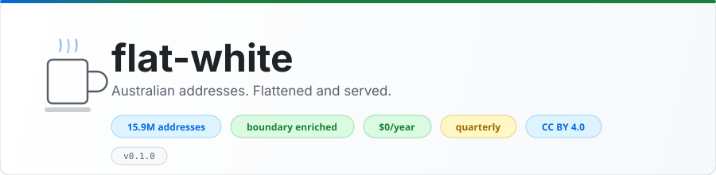

<picture>
  <source media="(prefers-color-scheme: dark)" srcset="docs/assets/banner-dark.svg">
  <source media="(prefers-color-scheme: light)" srcset="docs/assets/banner-light.svg">
  
</picture>

<p align="center">
  <a href="https://github.com/jbejenar/flat-white/actions/workflows/ci.yml"></a>
  <a href="./LICENSE"></a>
  
  
  <a href=".github/workflows/ariscan.yml"></a>
</p>

<p align="center">
  <a href="#quick-start">Quick start</a>&ensp;&bull;&ensp;
  <a href="docs/MIGRATING-TO-ASGS-2026.md">Migrate to schema 1.0.0</a>&ensp;&bull;&ensp;
  <a href="docs/DOCUMENT-SCHEMA.md">Document schema</a>&ensp;&bull;&ensp;
  <a href="#build-it-yourself">Build</a>&ensp;&bull;&ensp;
  <a href="docs/README.md">Documentation</a>
</p>

## What is this?

flat-white turns Australian G-NAF address data into **one JSON document per
principal address**. Each document brings together address text, geocodes,
locality details, aliases and administrative and census boundaries. Download a
state, read one line at a time, and use the data without recreating the source
joins.

It suits address search, bulk imports and geographic analysis. NDJSON is the
published download format; the code also provides Parquet and GeoParquet
converters for local use.

> **Schema 1.0.0 change:** mesh block, SA1–SA4 and GCCSA now use **ASGS 2026**.
> Their JSON shapes are unchanged, but their geographic meanings can differ.
> Read the [migration guide](docs/MIGRATING-TO-ASGS-2026.md) before upgrading.
> Check each release's metadata: this README describes the current code, while
> previously published schema 0.x downloads retain ASGS 2021.

## Quick start

You need the [GitHub CLI](https://cli.github.com/), `jq` and `gzip`. Choose a release
once, download its metadata, and check compatibility before downloading addresses.
Run these steps in a fresh directory so files from different releases stay separate.

```bash
# Resolve one tag. You can instead set TAG to a specific published release.
TAG=$(gh api repos/jbejenar/flat-white/releases/latest --jq '.tag_name')
gh release download "$TAG" --repo jbejenar/flat-white --pattern metadata.json
```

```bash
# Stop here if this fails: that release is not the contract used by this guide.
jq -e '.schemaVersion == "1.0.0" and .asgsYear == 2026' metadata.json
```

The check will fail if the latest published release is still schema 0.x. Select a
published 1.0.0 release when available, or keep using the older release with its
matching schema and ASGS 2021 references. Do not change the metadata to bypass
this check.

```bash
# Download Victoria from the same tag.
RELEASE_VERSION=$(jq -r '.version' metadata.json)
FILE="flat-white-${RELEASE_VERSION}-vic.ndjson.gz"
gh release download "$TAG" --repo jbejenar/flat-white --pattern "$FILE"

# Show a few Melbourne addresses. This parses JSON; it does not validate the schema.
gzip -cd "$FILE" | jq -c 'select(.postcode == "3000")' | head -n 3
```

Browse available files and their source versions on the [releases page](https://github.com/jbejenar/flat-white/releases).
Use the release metadata for counts rather than relying on estimates in a README.

## What's in a document?

Each NDJSON line is a complete address document. This **shortened, synthetic fixture
example** shows the census fields most affected by the migration:

```json
{
  "_version": "2026.02",
  "boundaries": {
    "meshBlock": {
      "code": "29900000083",
      "category": "Residential"
    },
    "sa1": "29901000103",
    "sa2": {
      "name": "Fixture 2026 SA2",
      "code": "299010001"
    },
    "sa3": {
      "name": "Fixture 2026 SA3",
      "code": "29901"
    },
    "sa4": {
      "name": "Fixture 2026 SA4",
      "code": "299"
    },
    "gccsa": {
      "name": "Fixture 2026 GCCSA",
      "code": "2TEST"
    }
  }
}
```

The fixture deliberately keeps February 2026 addresses and adds synthetic 2026
census assignments. Those codes are **test data**, not real ABS assignments.
Production schema 1.x builds require compatible sources from August 2026 or later.
A document's `_version` records the G-NAF quarter, not the schema or ASGS year.

The [document schema](docs/DOCUMENT-SCHEMA.md) defines every field and its
nullability. [Field provenance](docs/FIELD-PROVENANCE.md) traces each value to its
source. A missing boundary or geocode is represented by `null`; do not assume
every address has every enrichment.

## Verify your download

Continue with `FILE` set by the quick start:

```bash
# Check the compressed stream, then compare Victoria's row count with metadata.
gzip -t "$FILE"
ACTUAL=$(gzip -cd "$FILE" | wc -l | tr -d '[:space:]')
EXPECTED=$(jq -r '.states.VIC' metadata.json)
test "$ACTUAL" = "$EXPECTED"
```

For document validation, use a checkout matching the release's schema, install
its dependencies and run `npm run build`. Run this from the directory containing
the downloaded state file and its `metadata.json`:

```bash
node /path/to/flat-white/dist/verification-report.js . \
  --states VIC --output verification-report.md
```

Replace `/path/to/flat-white` with that checkout's path. The report streams the
compressed file, validates every document, checks state membership and reports
coverage for all census levels. The commands above check integrity, counts and
the document schema; they do not prove that an external geographic join uses the
right edition. The [migration checklist](docs/MIGRATING-TO-ASGS-2026.md#upgrade-in-six-steps)
covers that part.

## How it works

1. Discover and freeze the G-NAF and Admin Boundaries source versions for the run.
2. Start temporary Postgres with PostGIS, then load the sources with the pinned
   [gnaf-loader](https://github.com/minus34/gnaf-loader).
3. Prepare boundaries, spatially assign administrative areas, and look up census
   areas through the address's **2026 mesh-block code**.
4. Join and stream the address documents, validating each one with Zod.
5. Verify the output, split it by state and compress it. Stop Postgres when done.

The [boundary guide](docs/BOUNDARIES.md) explains the two enrichment methods.
Postgres is a build tool, not a database service you need to run to consume the files.

## Build it yourself

For development, use the committed fixture. It exercises preparation, spatial
joins, both flatten SQL paths, schema checks and the regression baseline without
a national download. You need Node.js 22.22.1 or newer and Docker with Compose.

```bash
git clone --recurse-submodules https://github.com/jbejenar/flat-white.git
cd flat-white
npm ci
./scripts/build-fixture-only.sh
```

Output goes to `output/fixture.ndjson`. Leave `GNAF_VERSION` unset for this command;
the fixture uses its frozen `2026.02` snapshot. See [contributor instructions](AGENTS.md)
and the [fixture guide](fixtures/README.md).

To exercise the container with the same small fixture:

```bash
docker build -t flat-white .
mkdir -p output
docker run --rm -v "$PWD/output:/output" flat-white --fixture-only --output /output
```

A production build processes the full source archives. **New source-lock requirement:**
acquire them once before starting the container. Each build checks the archives against
the recorded checksums. This example builds Victoria from August 2026; use the small
fixture above for development.

```bash
npm run build
GNAF_VERSION=2026.08 ADMIN_BDYS_VERSION=2026.08 node dist/source-lock.js acquire
mkdir -p output
docker run --rm -e GNAF_VERSION=2026.08 \
  -v "$PWD/sources:/sources:ro" -v "$PWD/output:/output" \
  flat-white --states VIC --compress --output /output
```

Omit `--states` for all states and territories. Both source quarters must be August
2026 or newer. The [release guide](docs/RELEASING.md#locked-sources-and-boundary-dates)
explains source discovery, exact-source rebuilds, boundary dates and cache validation.
The document contract remains schema 1.0.0; this change makes build inputs traceable.

## Distribution

The workflow checks upstream every **Monday at 02:00 UTC** and skips a quarter
that already has a published or draft release. New source data is still quarterly;
weekly discovery accommodates publication dates that move.

A production run builds ACT, NSW, NT, OT, QLD, SA, TAS, VIC and WA as separate jobs.
GitHub Releases carry per-state `.ndjson.gz` files, `metadata.json` and the document
schema. The combined national file is a workflow artifact, since it can exceed
GitHub's per-asset size limit. The configured S3 mirror publishes versioned files
and a manifest after the GitHub release is public. See [release checks and S3 recovery](docs/RELEASING.md).

Download all nine state files from the same checked tag with:

```bash
gh release download "$TAG" --repo jbejenar/flat-white --pattern 'flat-white-*-*.ndjson.gz'
```

Keep the files together with their metadata. Avoid broad globs across old download
directories: mixing quarters can duplicate addresses and mix geographic editions.

## Standing on shoulders

flat-white depends on Hugh Saalmans' [gnaf-loader](https://github.com/minus34/gnaf-loader)
to turn government source files into a usable PostGIS database. This repository
pins that work as a submodule and adds the flattened document contract, verification
and release pipeline. Thank you, Hugh, for maintaining the foundation.

gnaf-loader also serves people who need the relational tables and spatial tooling.
Choose the representation that fits your use case, and check the source quarter
and geography edition before comparing outputs from different pipelines.

## Documentation

Start at the [documentation index](docs/README.md), or go directly to:

- [Migration to schema 1.0.0 / ASGS 2026](docs/MIGRATING-TO-ASGS-2026.md) — impact, upgrade checks and rollback.
- [Document schema](docs/DOCUMENT-SCHEMA.md) — fields, types, nulls and version metadata.
- [Field provenance](docs/FIELD-PROVENANCE.md) and [boundary processing](docs/BOUNDARIES.md).
- [Release procedure](docs/RELEASING.md), [runbook](docs/RUNBOOK.md) and [loader updates](docs/GNAF-LOADER-UPDATES.md).
- [Fixtures](fixtures/README.md), [architectural decisions](docs/decisions/) and [current work](NEXT-WORK.md).
- [Changelog](CHANGELOG.md) and [historical roadmap](ROADMAP.md).

## Data sources and attribution

Sources: [G-NAF](https://data.gov.au/data/dataset/geocoded-national-address-file-g-naf)
and [Administrative Boundaries](https://data.gov.au/data/dataset/geoscape-administrative-boundaries).
Source data has its own licensing terms; the code licence does not replace them.

> G-NAF &copy; Geoscape Australia licensed by the Commonwealth of Australia under
> the Open G-NAF End User Licence Agreement.

> Administrative Boundaries &copy; Geoscape Australia licensed by the Commonwealth
> of Australia under CC BY 4.0.

## Licence

Code: [Apache 2.0](LICENSE).
